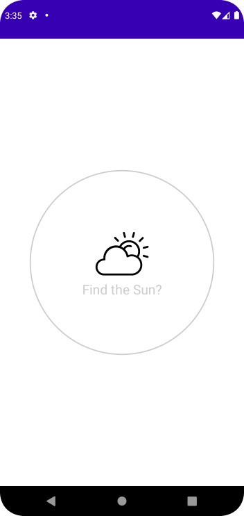
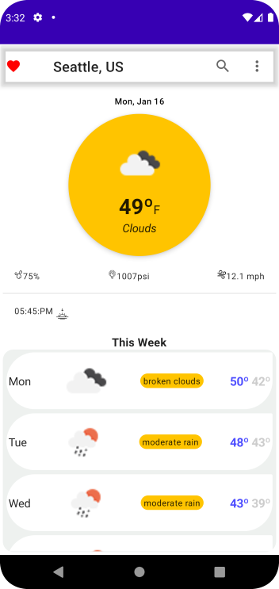
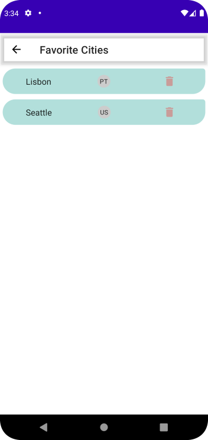

# Welcome to my profile
   
### About Me:

  Hi, I'm Daniel Melo, Software Engineer and Developer from Brazil
   
   
  👨‍🎓 I have a Bachelor's degree in Software Engineering from Brigham Young University - Idaho
   
  💻 I love writing code and building products that cause an impact in people's lives 😊
   
  📚 My area of expertise is in Mobile App Development
   
  📫 How to reach me 👇

    

<h2 align="center">🔥 Languages & Frameworks & Tools & Abilities 🔥</h2> 

  <code></code>
  <code></code>
  <code></code>
  <code></code>
  <code></code>
  <code></code>
  <code></code>
  <code></code>
  <code></code>
  <code></code>
  <code></code>
  <code></code>
  <code></code>
  <code></code>
  <code></code>
  <code></code>
  <code></code>

<h2 align="center">⚡ Stats ⚡</h2>
 

<h2 align="center">💹 Most Popular Repos 💹</h2>
 

  
    

<h2 align="center"> Most Important Projects </h2>
 

<!-- Mycon -->

 
<h3> Mycon </h3>

 

Designed, implemented, tested, launched and maintained this project for almost 3 years. This mobile application has more than 100 thousand downloads and has over 5 thousand daily active users. It also counts with a 4.7 rating on Google Play Store and 4.8 on App Store by the time I left the company. Some of the technolodies used are: 
1. Kotlin
2. OkHttp
3. Dart
4. Flutter
5. Firebase

 

<a href="https://play.google.com/store/apps/details?id=br.com.mycon.client.app">
<code></code>
</a>

<a href="https://apps.apple.com/us/app/mycon/id1489365751">
<code></code>
</a>

 
 

<!-- Oficinei -->

 

<h3> Oficinei </h3>

 

Built complete application from backend to frontend and mobile app. This is a propietary solution I developed and sold for a few businesses about two years ago. Some of the technologies used are: 
1. Nodejs 
2. HTML
2. CSS
3. Javascript
4. Flutter
5. MongoDB 

 

<a href="https://play.google.com/store/apps/details?id=br.com.oficinei.appcliente.oficineicliente">
<code></code>
</a>

 
 

 

<h3> Weather Forecast App </h3>

 

Built weather forecast android application using the open weather map API, Kotlin, and Jetpack Compose. 

1. Kotlin
2. Retrofit
3. GSON
4. Dagger Hilt
5. Coroutines
6. REST API

 

<!---
HalemoGPA/HalemoGPA is a ✨ special ✨ repository because its `README.md` (this file) appears on your GitHub profile.
You can click the Preview link to take a look at your changes.
--->
